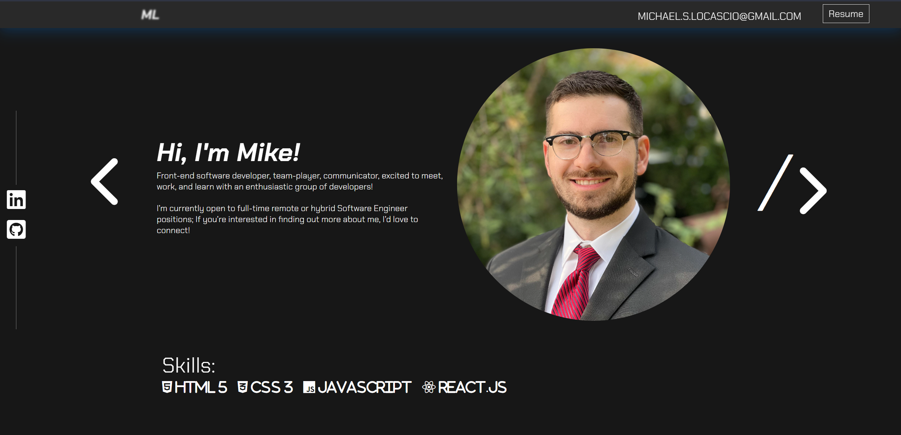
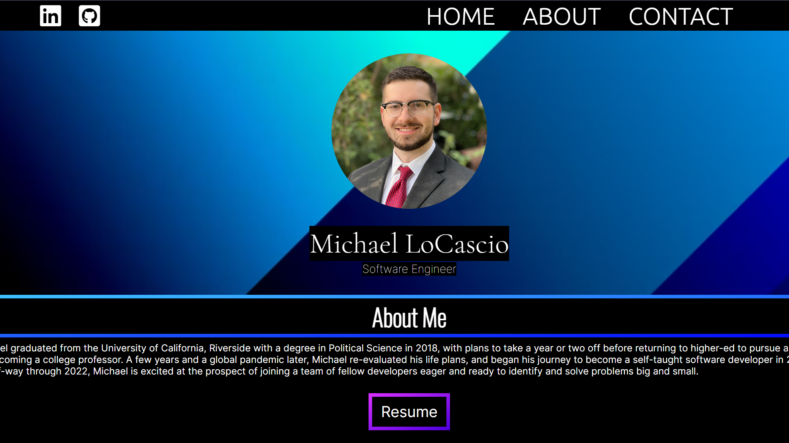

# msl-website V2.0

Second major iteration of Michael LoCascio's software engineering portfolio website, built with React.js. Access the live site via michaellocascio.com or mikelocascio.com.

## Designed interface with design tool Figma

https://user-images.githubusercontent.com/96447034/207236801-13a1a89e-d434-4589-84ae-0c45a88aa9ea.MP4

With the use of Figma, I was able to place my original website design side-by-side with what I envisioned for the updated version of my project. The goals I set for this update included:

* Maximizing screen real estate by taking greater advantage of horizontal space (namely by placing my profile image next to my about-me section for larger displays)
* Simplifying the site visually to ensure quick and easy access to important information
* Consistency in color, font-family, and button design.

# V1.0

In version 1, I toyed around with the linear-gradient feature in css, which lead to a stark blue gradient border on black background. I initially liked this look, but after time away found that it was maybe a bit too heavy handed. I also gave far too much priority to my profile picture as a centerpiece, and the width of my about section didn't lend itself well to readability. For a first crack at programming a personal portfolio site with React, it wasn't too bad, but provided a strong foundation for later updates.

